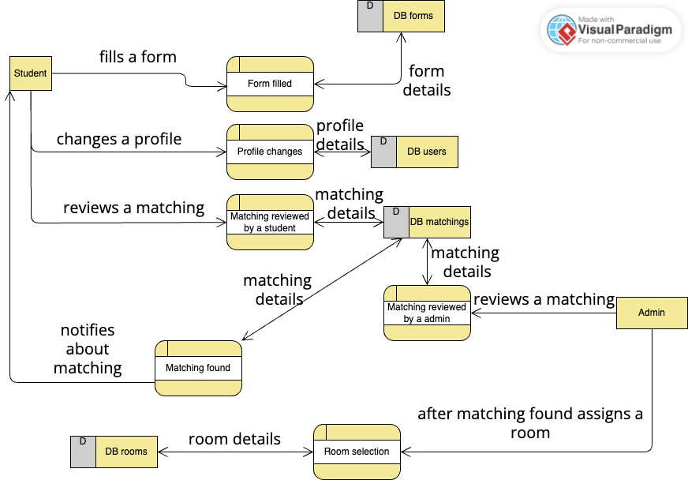

# PoZiomka

## Startup locally

### Frontend

```sh
  cd frontend; ng serve
```

### Backend

```sh
  cd backend; dotnet run
```

## Tools versions

```sh
  dotnet --version
```

8.0.406

```sh
  ng --version
```

19.1.5

```sh
  npm --version
```

10.8.2

```sh
  node --version
```

v20.18.2

```sh
  nvm --version
```

0.40.1

## Tech stack
#### angular
#### dotnet
#### ms sql server
#### azure deployment

## Formatowanie Frontend'u

```sh
  npx prettier . --write
```

## C00l diagram

